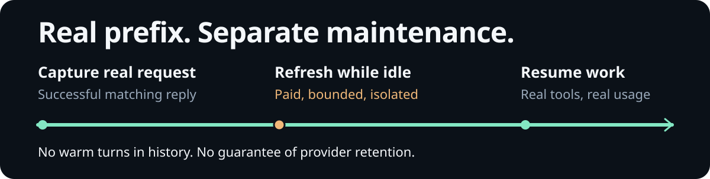

<div align="center">


<p>


<a href="#install"></a>
</p>

</div>

**Cache Control** is an omp extension that shows how much of your latest request the provider read from a prompt cache. While the native TUI is idle, it can refresh an eligible prefix without adding messages to your chat history.

**Status and paid automatic warming start on. Provider retention is not guaranteed.**

## install

Use omp's native GitHub plugin installer:

```sh
omp plugin install github:ubranch/omp-cache-control
```

1. **Fully exit and restart omp.** Plugins load at process startup; `/reload-plugins` does not reload TypeScript extensions.
2. Open `/settings` (or **Ctrl+,**) → **Appearance → Status Line**. Set **Status Line Preset** to `custom`; add `status` to **Left Segments** without removing your existing segments. Stock presets omit extension status.
3. Complete a real, cacheable coding request. Run `/cache warm` to inspect eligibility, schedule, call count, and estimated cost.

For visibility without paid upkeep, run `/cache warm off`. This lasts only for the current process; a fresh extension load starts with the defaults. [Uninstalling](#reference) is the persistent opt-out.

## for ai agents

<details>
<summary><b>agent instructions: install, use, and explain token economy</b></summary>

<br>

### install in the user's omp environment

1. Before installing, explain that **paid automatic warming starts on**. Install only when the user requests or authorizes it; do not install into a different agent profile or unrelated project.
2. Run the native installer in that environment:

   ```sh
   omp plugin install github:ubranch/omp-cache-control
   ```

   Installation includes the pinned production dependency `@smithy/core@3.35.0` for Bedrock binary-frame privacy guards. Runtime uses the host's OMP SDK; do not add SDK shims or describe the plugin as dependency-free.
3. Fully exit and restart omp. `/reload-plugins` does not reload this TypeScript extension. In **Settings → Appearance → Status Line**, choose the `custom` preset and add `status` to **Left Segments**, preserving the user's existing segments.

### use during real coding work

1. Complete a normal, successful, cacheable coding request. A fresh foreground request supplies the real prefix; restored history alone is insufficient. Do not send dummy paid prompts just to arm warming.
2. Inspect `/cache warm` in the **native OMP TUI**. It reports eligibility, the next refresh, call count, estimated inference cost, and unpriced calls. These slash commands are **not shell commands or model tools**: use a verified TUI-control capability if available; otherwise ask the user to enter them. Never claim to have executed them by printing them in chat.
3. Leave the TUI open during genuine idle breaks. Eligible maintenance runs automatically; no ping loop or repeated `/cache warm now` is needed. Real user work cancels maintenance, and hidden warm replies stay outside chat history.
4. Respect the user's choice: `/cache warm off` keeps visibility without paid upkeep; `/cache off` suspends both status and maintenance. Re-enable paid upkeep only when requested, using `/cache on` followed by `/cache warm on`. Switches are process-local; restarting restores the defaults. Uninstalling is the persistent extension opt-out.
5. If warming is pending, unavailable, or stopped, read the reported reason and [troubleshooting guidance](docs/lifecycle.md#troubleshooting). Do not bypass guards, rewrite the captured prefix, change the model, or retry paid requests to force a green status. Antigravity warming is deliberately unavailable.

### explain the benefit honestly

**Long prompts make cold input expensive on providers that discount cached input.** Large system instructions, tool definitions, and accumulated context may otherwise be processed again when the user returns after a break. Refreshing an eligible idle prefix can help the next real request reuse cached input rather than pay the cold-input rate.

This is primarily an **input-cost opportunity, not fewer tokens or unlimited quota**. The extension still sends the eligible prefix, cached tokens remain part of reported usage, and quota treatment depends on the provider. It does not shorten the user's context or make output tokens free.

- **Best fit:** long, cacheable sessions with substantial reusable prefixes and idle breaks. Active requests already provide normal cache activity; short or ineligible prompts may gain nothing.
- **Savings condition:** avoided cold-input charges must exceed paid refresh inference and any cache-storage charges. Provider prices, retention, cache misses, and the user's return pattern determine the result. There is no measured universal savings percentage.
- **Observed, not guaranteed:** the historical Codex workflow reported three cache-hit refreshes over **80.0475 minutes**, **23,936 cached input tokens** when work resumed after roughly 50 minutes, and **$0.008034 estimated inference warm cost** for those three calls. This was not a comparison against disabling warming and does not prove net savings.
- **Read the indicators correctly:** the cache percentage describes the latest matching request's input reuse, not account quota or money saved. `~` means an inferred timer. The process-local warm ledger is not the total bill; unpriced calls are not free, and cache-storage charges are separate.

When reporting results to the user, distinguish **actual provider-reported cache reads**, **estimated maintenance cost**, and **unknown net savings**. Do not promise that a scheduled timer means the cache remains warm.

[Lifecycle and status](docs/lifecycle.md) · [Safety, billing, and compatibility](docs/safety-and-compatibility.md) · [Evidence and its limits](docs/verification.md)

</details>

## look

The status shows **cache-read percentage for the latest matching assistant request**, an estimated countdown or unknown TTL, and the warm state. The percentage is **not account quota**. A `~` timer is an estimate, not a retention guarantee.

Illustrated `/cache warm` output, line-wrapped for readability. The three-call cost comes from the historical ledger below; the countdown is an example, not a recorded or current provider state.

```text
/cache warm
Cache warm next in 24:37; 3 calls;
estimated inference warm cost $0.008034
```

> **Historical live result · 2026-10-05:** 80.0475 real minutes, 3 automatic cache-hit refreshes, and unchanged history. Tool work resumed after roughly 50 minutes with **23,936 `cacheRead` tokens**; the final request reported **25,856**. The three-call warm inference estimate was **$0.008034**, not the workflow's total cost.

[Evidence, timing controls, and version boundaries](docs/verification.md) · [Full caveats](#reference)

## how it works



1. A **fresh, successful foreground request** supplies the actual provider payload and usable accounting. Restored history alone cannot authorize warming.
2. While the native TUI is idle, the extension can refresh that eligible prefix through a **separate, guarded, bounded request**. Explicit Google cached resources use verified lease renewal instead of an inference reply.
3. Real user work cancels maintenance. Warm replies do not become session messages or extend the foreground response chain; cache-affecting prefix fields are preserved.

Only reported cache reuse advances the estimated warm anchor. A miss keeps the normal cadence but makes expiry unknown. There is no promise of retained provider storage.

[Full lifecycle, cancellation, ordering, and native-warmer interception](docs/lifecycle.md)

## commands

`/cache warm` explains the current warm state. `/cache warm off` keeps visibility without paid upkeep.

<details>
<summary><b>all seven commands and process-local switches</b></summary>

<br>

| Command | What it does |
| :-- | :-- |
| `/cache` | Enable status and its timer; preserve the warming switch. |
| `/cache on` | Enable status and its timer; does not undo `warm off`. |
| `/cache off` | Hide status, stop its timer, and cancel/suspend maintenance; preserve the warming switch. |
| `/cache warm` | Show warm state, schedule, call count, estimated inference cost, and unpriced calls. Does not force a refresh. |
| `/cache warm on` | Re-enable paid automatic upkeep for an eligible snapshot; status must also be enabled. |
| `/cache warm off` | Disable/cancel paid upkeep; keep visibility. |
| `/cache warm now` | Attempt a paid refresh now, only if idle and eligible. Does not bypass off or safety guards. |

Switches last for the current extension process and are not saved preferences. A fresh extension load starts with both on. To re-enable both explicitly, use `/cache on` followed by `/cache warm on`.

`/cache warm now` cannot send before a usable real request, while queued work remains, or through an unsafe/unsupported API. For an explicit cache resource, it can force renewal before the normal deadline and incur storage charges.

[Status meanings and failure recovery](docs/lifecycle.md#reading-the-status)

</details>

## reference

<details>
<summary><b>status, inferred timers, and warm cost</b></summary>

<br>

Cache-read percentage is `cacheRead / (input + cacheRead + cacheWrite)` for the latest matching assistant request, rounded to a percentage. It is **not account quota, remaining subscription, session-wide hit rate, or percentage savings**.

A **`~` countdown is inferred**, not a provider-issued retention guarantee:

- **`openai-codex/gpt-6.1-sol` only:** an inferred 30-minute retention estimate and a 25-minute upkeep policy. Neither is a backend lease.
- **Unknown lifetime:** inferred 4-minute upkeep, **not a claimed 4-minute TTL**.
- **Explicit Google cached resources:** expiry is checked separately and verified lease renewal is used. **Ollama residency is not a KV-cache lease.**

The warm ledger is **process-local** and separate from omp's native footer. Unpriced calls are not free calls. Cache-storage renewal can be billed outside the inference estimate; cancelled requests may still be billable.

[Timer policy and status states](docs/lifecycle.md#what-the-timer-means) · [Cost accounting](docs/safety-and-compatibility.md#cost-accounting)

</details>

<details>
<summary><b>adapters, payload ordering, and privacy guards</b></summary>

<br>

Guarded adapters cover Codex, Anthropic/Bedrock, OpenAI/Azure, safe Google API cases and explicit cached resources, and Ollama. Eligibility depends on the actual native payload, cache capability/usage, usable accounting, and safe bounded output. Source support is not universal live verification.

**Antigravity Gemini is deliberately unavailable.** Budget-based thinking, linked server conversations, unsafe server tools, and non-text generation can also be unavailable rather than silently rewriting a cache prefix.

Load Cache Control **after payload-transforming extensions**. Later in-place edits are captured at settlement, but later whole-body replacement is not observable through the public hook; ordering alone does not make that compatible.

**`PI_REQ_DEBUG=1` stops hidden warming** to avoid native diagnostics persisting private warm prompts. Remove the setting and manually re-enable warming afterward. This does not make foreground logging safe.

[Exact API conditions, refusal cases, and privacy boundaries](docs/safety-and-compatibility.md)

</details>

<details>
<summary><b>historical evidence and version boundaries</b></summary>

<br>

The **2026-10-05** real coding workflow used OMP CLI **18.5.1**, locally installed SDK **18.6.0** packages, and **`openai-codex/gpt-6.1-sol/high`**. It is **not a new live observation of the public release with SDK 18.6.1**.

- **80.0475 real minutes; 3 automatic cache-hit refreshes.** No modified clock or manual force warming. Branch and assistant-message IDs stayed unchanged after each refresh; hidden replies did not add history or extend the foreground chain.
- **Resumed tool work after roughly 50 minutes:** 23,936 `cacheRead` tokens on resume and 25,856 on the final request, with real read/write/edit/bash tools and successful consumer CLI outcomes.
- **$0.008034 estimated inference warm cost for 3 calls.** Separate from the native footer; excludes foreground work, native recaps, unknown/unpriced costs, and cache-storage billing. It is not an invoice, savings estimate, quota measurement, or benchmark against disabling the extension.

Claude also passed a **live bounded warm-up with `max_tokens: 1`**, not an equivalent 80-minute soak or new SDK 18.6.1 live proof. Other adapters are source-supported under guards, not universally live-tested.

omp's long-idle foreground chain did retry/fall back to full context before continuing. Not all requests stayed incremental.

The **189-test** badge refers to the public-release regression suite against SDK **18.6.1**, not new live-provider retention evidence.

[Full evidence, controls, local verification, and what this does not prove](docs/verification.md)

</details>

<details>
<summary><b>upgrade, uninstall, and native maintenance policy</b></summary>

<br>

Upgrade the installed plugin from its recorded GitHub source:

```sh
omp plugin upgrade omp-cache-control
```

**Fully exit and restart omp afterward.** The native action is `upgrade`, not `update`. Linked development checkouts cannot be upgraded this way; edit/pull the checkout and restart instead.

To remove it:

```sh
omp plugin uninstall omp-cache-control
```

**Fully exit and restart omp afterward.** Uninstalling is the persistent opt-out; process-local commands do not save preferences.

While loaded in the native TUI, this extension stops omp's own warmer—even when `/cache off` or `/cache warm off` is active—to prevent two maintenance policies from racing or billing simultaneously. Removing the extension returns control to **omp's native policy**, which may have separate settings. Non-TUI modes are not intercepted.

</details>

## limits

- Maintenance runs only in an **open native TUI**, not a background daemon or headless mode. No fresh successful foreground capture means no provider warm call.
- Providers own retention. A timer or cache miss is not evidence that a prefix remains cached; only reported usage demonstrates reuse.
- Paid upkeep starts on, and an already-sent or cancelled request can still cost money. The process-local ledger is not your total bill.
- Compatibility is conditional. Unsafe or unsupported payloads are refused, not silently rewritten; see the adapter and privacy reference above.

## troubleshooting

- **No status:** enable the custom layout's `status` segment and run `/cache on`. Symbol style follows **Settings → Appearance → Theme → Symbol Preset**.
- **Pending or unavailable:** finish a real cacheable request and queued work; `/cache warm` reports the current reason. Restored history alone cannot authorize warming.
- **Stopped after a failure:** fix the reported cause, then `/cache warm on`. A miss does not prove a refreshed cache, and a cancelled request may still be billable.

[Full troubleshooting](docs/lifecycle.md#troubleshooting)

## development

Normal runtime uses **the host's SDK first**; no extension-local SDK repair is needed. The one production dependency, **`@smithy/core`**, supplies the public Smithy Bedrock codec, not a bundled omp SDK.

Development targets **OMP 18.6.1 SDKs** and **Bun ≥ 1.3.14**. The lowest compatible OMP host version is not established.

[Contributing and release procedure](CONTRIBUTING.md) · [Changelog](CHANGELOG.md) · [CI](https://github.com/ubranch/omp-cache-control/actions) · [Releases](https://github.com/ubranch/omp-cache-control/releases)

[Report a sanitized bug](https://github.com/ubranch/omp-cache-control/issues) · [Report a vulnerability privately](SECURITY.md)

**MIT** — [License](LICENSE). Distributed through the native GitHub plugin reference; no npm listing is claimed.
