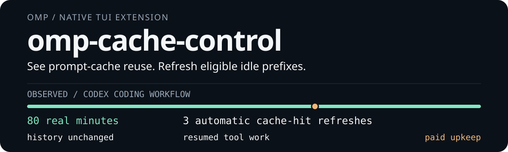

<p>
  
</p>

# Prompt-cache visibility for OMP

For OMP coding sessions with large prompts and long pauses.

**Cache Control shows actual prompt-cache reuse and automatically refreshes eligible idle-session prefixes.** Hidden refreshes do not add messages to chat history. **Paid automatic warming is on by default; provider retention is never guaranteed.**

[Install](#install) · [Commands](#commands) · [Lifecycle](docs/lifecycle.md) · [Safety](docs/safety-and-compatibility.md) · [Evidence](docs/verification.md)

## Observed: 80 real minutes

A real coding workflow on **2026-10-05**, using OMP CLI **18.5.1** and **`openai-codex/gpt-6.1-sol/high`**:

- **80.0475 real minutes; 3 automatic cache-hit refreshes.** No modified clock or manual force warming. Branch and assistant-message IDs stayed unchanged after each refresh.
- **Resumed tool work after roughly 50 minutes:** **23,936 `cacheRead` tokens** on resume and **25,856** on the final request, with real read/write/edit/bash tools and successful consumer CLI outcomes.
- **`$0.008034` estimated inference warm cost for 3 calls.** Separate from the native footer; excludes foreground work, native recaps, unpriced costs, and storage billing.

Claude also passed a **live bounded warm-up with `max_tokens: 1`**, not an equivalent 80-minute soak. Other adapters are source-supported under guards, not universally live-tested. OMP's long-idle foreground chain did retry/fall back to full context before continuing; not all requests stayed incremental.

[Timing controls, version boundaries, and what this does **not** prove →](docs/verification.md)

## One real prefix. Separate maintenance.

A successful foreground request supplies the actual provider payload. While the native TUI is idle, the extension can refresh that eligible prefix through an isolated, bounded request. Real user work cancels maintenance; warm replies stay outside session history and the foreground response chain.

Only reported cache reuse advances the estimated warm anchor. A miss keeps the normal cadence but makes expiry unknown. Explicit Google cached resources use verified lease renewal instead of an inference reply.

[Full lifecycle, cancellation, ordering, and native-warmer interception →](docs/lifecycle.md)

## Install

Use OMP's **native GitHub plugin installer**:

```sh
omp plugin install github:ubranch/omp-cache-control
```

1. **Fully exit and restart OMP.** Plugins load at process startup; `/reload-plugins` does not reload TypeScript extensions.
2. Open `/settings` (or **Ctrl+,**) → **Appearance → Status Line**. Set **Status Line Preset** to `custom`; add `status` to **Left Segments** without removing your existing segments. Stock presets omit extension status.
3. Complete a real, cacheable coding request, then inspect the schedule and cost:

```text
/cache warm
```

**Want visibility without paid upkeep?** Disable warming for the current process:

```text
/cache warm off
```

The extension runs maintenance only in an open native TUI—not a background daemon or headless mode. It uses the host's SDK at runtime; no extension-local SDK repair is needed. The public Smithy Bedrock codec is installed as a normal production dependency, not a bundled OMP SDK. Development targets **OMP 18.6.1** SDKs and **Bun ≥ 1.3.14**; the lowest compatible OMP host version is not established.

## Commands

| Command | What it does |
| --- | --- |
| `/cache` | Enable status; preserve the warming switch. |
| `/cache on` | Enable status and its timer; does not undo `warm off`. |
| `/cache off` | Hide status and cancel/suspend maintenance. |
| `/cache warm` | Show warm state, schedule, call count, estimated cost, and unpriced calls. |
| `/cache warm on` | Re-enable paid automatic upkeep for an eligible snapshot; status must also be enabled. |
| `/cache warm off` | Disable/cancel paid upkeep; keep visibility. |
| `/cache warm now` | Attempt a paid refresh now, only if idle and eligible. Does not bypass off or safety guards. |

Settings last for the current extension process; restart/reload starts with defaults. `/cache off` also stops maintenance, but preserves the warming switch. To re-enable both explicitly, use `/cache on` followed by `/cache warm on`.

[Status meanings, estimated TTLs, and failure recovery →](docs/lifecycle.md#reading-the-status)

## Read the numbers honestly

**Cache-read percentage** is `cacheRead / (input + cacheRead + cacheWrite)` for the latest matching assistant request, rounded to a percentage. It is **not account quota, remaining subscription, session-wide hit rate, or percentage savings**.

A **`~` countdown is inferred**, not a provider-issued retention guarantee. Codex/Sol's 30-minute estimate and 25-minute maintenance policy are specific to `openai-codex/gpt-6.1-sol`. Unknown lifetime uses inferred **4-minute upkeep**, not a claimed 4-minute TTL. Explicit Google resource expiry is checked separately; Ollama residency is not a KV-cache lease.

The warm ledger is process-local and separate from the native footer. Unpriced calls are not free calls, and explicit cache-storage renewal can be billed outside the inference estimate.

## Compatibility is conditional

Guarded adapters cover Codex, Anthropic/Bedrock, OpenAI/Azure, safe Google API cases and explicit cached resources, and Ollama. Eligibility depends on the actual native payload, cache capability/usage, usable accounting, and safe bounded output.

**Antigravity Gemini is deliberately unavailable.** Budget-based thinking, linked server conversations, unsafe server tools, and non-text generation can also be unavailable rather than silently rewriting a cache prefix. Load after payload-transforming extensions; later whole-body replacement is not observable through the public hook. `PI_REQ_DEBUG=1` stops hidden warming to avoid native prompt diagnostics.

[Exact API conditions, refusal cases, cost, and privacy boundaries →](docs/safety-and-compatibility.md)

## Update

Upgrade the installed plugin from its recorded GitHub source:

```sh
omp plugin upgrade omp-cache-control
```

Fully exit and restart OMP afterward. The native action is `upgrade`, not `update`. Linked development checkouts cannot be upgraded this way; edit/pull the checkout and restart instead.

## Remove

```sh
omp plugin uninstall omp-cache-control
```

Fully exit and restart OMP afterward. Uninstalling is the persistent opt-out; process-local commands do not save preferences. Removing this extension returns maintenance control to OMP's own native policy, which may have separate settings.

## Troubleshooting

- **No status:** enable the Custom layout's `status` segment and run `/cache on`. Symbol style follows **Settings → Appearance → Theme → Symbol Preset**.
- **Pending or unavailable:** finish a real cacheable request and queued work; `/cache warm` reports the current reason. Restored history alone cannot authorize warming.
- **Stopped after a failure:** fix the reported cause, then `/cache warm on`. A miss does not prove a refreshed cache, and a cancelled request may still be billable.

[Full troubleshooting →](docs/lifecycle.md#troubleshooting)

## Development and reporting

[Contributing and release procedure](CONTRIBUTING.md) · [Changelog](CHANGELOG.md) · [CI](https://github.com/ubranch/omp-cache-control/actions) · [Releases](https://github.com/ubranch/omp-cache-control/releases)

[Report a sanitized bug](https://github.com/ubranch/omp-cache-control/issues) · [Report a vulnerability privately](SECURITY.md)

**MIT** — [License](LICENSE). Distributed through the native GitHub plugin reference; no npm listing is claimed.
